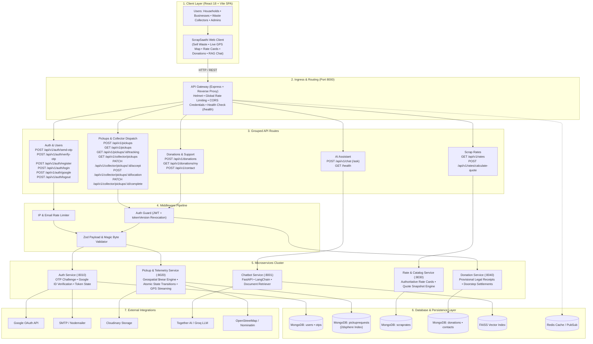
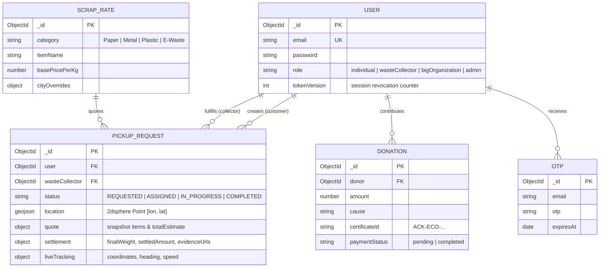

# ScrapSaathi

## Overview

ScrapSaathi is a distributed scrap-pickup marketplace connecting households and commercial waste generators with verified local scrap collectors and recycling facilities. Users schedule doorstep pickups with item specifications, photo uploads, and GPS coordinates, while viewing city-specific rate cards and tracking collectors in real time. The platform provides collectors with geospatial dispatch, atomic request claiming, and doorstep weighment settlement, supported by a RAG-powered recycling assistant.

---

## Features

- **Multi-Role Workflows**: Dedicated dashboards and role permissions for Individual Sellers, Waste Collectors, Bulk Organizations, and Admins.
- **Geospatial Pickup Dispatch**: Schedule pickups with auto-calculated quotes; collectors discover nearby jobs via MongoDB `$near` 2dsphere indexing.
- **Atomic State Transitions**: Anti-race condition acceptance (`REQUESTED` → `ASSIGNED` → `IN_PROGRESS` → `COMPLETED`) preventing duplicate claims.
- **Live Collector GPS Tracking**: Real-time vehicle telemetry ingestion with dynamic distance and ETA calculation.
- **Doorstep Weighment Settlement**: Record actual weights, digital/cash payouts, and dispute-proof evidence uploads.
- **Authoritative Scrap Rates**: Dynamic pricing catalog across paper, metals, plastics, and e-waste with server-validated quotes.
- **Eco-Donations**: Community green causes backed by verifiable provisional legal acknowledgements (`ACK-ECO-...`).
- **AI RAG Assistant**: Natural language recycling guide powered by FastAPI, LangChain, and FAISS vector embeddings.

---

## Tech Stack

| Layer | Technology |
|---|---|
| **Frontend** | React 18, Vite, TailwindCSS, React Router 7, Leaflet Maps, Axios |
| **API Gateway** | Node.js, Express, `http-proxy-middleware`, Helmet, Express Rate Limit |
| **Microservices** | Node.js (v20), Express 4, Mongoose 8, Zod, Multer, Bcrypt |
| **AI / Chatbot** | Python 3.11, FastAPI, LangChain, FAISS Vector Store, Sentence Transformers |
| **Database & Cache** | MongoDB (Atlas / 2dsphere indexing), Redis 7 (caching & rate-limiting) |
| **Authentication** | JWT (Cookie/Bearer), `tokenVersion` session revocation, Google OAuth 2.0 |
| **External Services** | Cloudinary, Nodemailer (SMTP), Together AI / Groq LLM, OpenStreetMap |
| **DevOps / Orchestration** | Docker, Docker Compose, Kubernetes manifests (`k8s/`) |

---

## System Architecture

### HLD Diagram



### Main Request Flow

```text
User Action
  └──> Frontend (React + Vite)
        └──> API Gateway (:8000) [CORS, Rate Limiting, Route Proxy]
              └──> Auth / Validation Middleware [JWT verification, tokenVersion session check, Zod schema]
                    └──> Microservice Controller & Service Logic [Port :8010-:8040 or :8001]
                          └──> MongoDB Atlas / FAISS [Atomic updates, 2dsphere queries, vector search]
                                └──> JSON Response via Gateway back to Client
```

1. The client sends an HTTP request to the unified API Gateway (`:8000`) with credentials (`httpOnly` cookie or Bearer token).
2. The Gateway inspects headers, enforces rate limits, and reverse-proxies to the target domain microservice.
3. Service middleware validates the JWT and verifies that `decoded.version === user.tokenVersion` to block revoked tokens.
4. The service executes domain logic (atomic conditional updates, geospatial `$near` calculations, or quote snapshots).
5. Data is committed to MongoDB, and formatted JSON returns to the client.

---

## API Reference

### Authentication & Users (`services/auth-service` :8010)

| Method | Endpoint | Description |
|---|---|---|
| `POST` | `/api/v1/auth/send-otp` | Generates and sends a 6-digit OTP to the user's email |
| `POST` | `/api/v1/auth/verify-otp` | Verifies OTP and returns a signed `verificationToken` |
| `POST` | `/api/v1/auth/register` | Registers account (requires valid `verificationToken`) |
| `POST` | `/api/v1/auth/login` | Authenticates credentials and sets `httpOnly` JWT cookie |
| `POST` | `/api/v1/auth/google` | Verifies Google ID token and issues authenticated session |
| `POST` | `/api/v1/auth/logout` | Revokes active session tokens across devices via `tokenVersion` |
| `GET` | `/api/v1/auth/me` | Returns authenticated user profile and permissions |

### Pickups & Collector Dispatch (`services/pickup-service` :8020)

| Method | Endpoint | Description |
|---|---|---|
| `POST` | `/api/v1/pickups` | Creates pickup request with items, address, coordinates, and photo |
| `GET` | `/api/v1/pickups` | Retrieves current user's pickup history and statuses |
| `GET` | `/api/v1/pickups/:id/tracking` | Returns live GPS coordinates, heading, and ETA of assigned collector |
| `GET` | `/api/v1/collector/pickups` | Finds unassigned pickups near collector using `$near` 2dsphere |
| `PATCH` | `/api/v1/collector/pickups/:id/accept` | Atomically claims a pickup request (`REQUESTED` → `ASSIGNED`) |
| `POST` | `/api/v1/collector/pickups/:id/location` | Ingests real-time vehicle GPS telemetry from collector app |
| `PATCH` | `/api/v1/collector/pickups/:id/complete` | Submits doorstep weighment, settlement amount, and photo evidence |

### Scrap Rates & Pricing (`services/rate-service` :8030)

| Method | Endpoint | Description |
|---|---|---|
| `GET` | `/api/v1/rates` | Fetches scrap rate cards filtered by category and city |
| `POST` | `/api/v1/rates/calculate-quote` | Computes authoritative quote snapshot from line items and city rates |

### Donations & Support (`services/donation-service` :8040)

| Method | Endpoint | Description |
|---|---|---|
| `POST` | `/api/v1/donations` | Records eco-donation and issues provisional receipt (`ACK-ECO-...`) |
| `GET` | `/api/v1/donations/my` | Retrieves user donation contribution records |
| `POST` | `/api/v1/contact` | Submits customer support and inquiry messages |

### AI RAG Chatbot (`services/chatbot-service` :8001)

| Method | Endpoint | Description |
|---|---|---|
| `POST` | `/api/v1/chat` (`/ask`) | Submits user recycling query for vector retrieval and LLM response |
| `GET` | `/health` | Health check for RAG pipeline and vector store readiness |

---

## Database

ScrapSaathi uses **MongoDB** as its primary operational datastore with a `2dsphere` spatial index on pickup coordinates, alongside an in-memory **FAISS** vector database for AI knowledge retrieval.



---

## Project Structure

```text
ScrapSathi/
├── docs/                 # OpenAPI 3.0 specification & architecture docs
├── packages/
│   └── shared/           # @scrapsathi/shared (ApiError, logger, token auth middleware)
├── services/
│   ├── api-gateway/      # Port 8000: Ingress reverse proxy & rate limiter
│   ├── auth-service/     # Port 8010: Authentication, OTP verification, Google OAuth
│   ├── pickup-service/   # Port 8020: Geospatial dispatch, GPS telemetry, state machine
│   ├── rate-service/     # Port 8030: Scrap rate cards & quote calculation engine
│   ├── donation-service/ # Port 8040: Eco-donations & provisional legal acknowledgements
│   └── chatbot-service/  # Port 8001: FastAPI + LangChain + FAISS assistant
├── Frontend/             # React 18 + Vite SPA client
├── tests/                # Automated integration test suite (8/8 pass)
├── k8s/                  # Kubernetes deployment manifests
├── docker-compose.yml    # Full microservices stack orchestration with Redis
├── package.json          # Root monorepo workspace configuration
└── README.md             # System architecture & documentation
```

---

## Setup & Run

### Prerequisites

- **Node.js**: v18.x or v20.x
- **Docker & Docker Compose**: (Recommended for running full stack)
- **MongoDB**: MongoDB Atlas URI or local instance on `localhost:27017`

### 1. Run with Docker Compose (Recommended)

Builds and starts all 6 microservices, Redis, and the Frontend in a shared network:

```bash
docker compose up --build
```

- **Frontend Application**: `http://localhost:5173`
- **API Gateway**: `http://localhost:8000`
- **Gateway Health Check**: `http://localhost:8000/health`

### 2. Local Development (NPM Workspaces)

```bash
# 1. Install dependencies across all workspaces
npm install

# 2. Run all microservices concurrently
npm run dev

# 3. In a separate terminal, start frontend dev server
npm run dev:frontend
```

### 3. Run Automated Tests

Executes the integration test suite validating auth gates, magic bytes, geospatial radius, and quote snapshots:

```bash
npm test
```

---

## Environment Variables

Configure these variable names in your root `.env` or container runtime (never commit actual secrets):

```bash
# Server & Database
PORT=8000
MongoDB=mongodb+srv://<user>:<password>@cluster.mongodb.net/scrapsathi
NODE_ENV=production

# Security & Authentication
JWT_SECRET=your_jwt_secret_minimum_32_characters
JWT_EXPIRES_IN=24h
GOOGLE_CLIENT_ID=your_google_oauth_client_id

# Email (OTP Service)
PRIMARY_EMAIL=your_email@gmail.com
PRIMARY_EMAIL_PASSWORD=your_app_specific_password

# Cloud Storage
CLOUDINARY_CLOUD_NAME=your_cloudinary_name
CLOUDINARY_API_KEY=your_cloudinary_key
CLOUDINARY_API_SECRET=your_cloudinary_secret

# Chatbot AI
TOGETHER_API_KEY=your_together_ai_api_key

# Frontend
VITE_DEV_BASE_URL=http://localhost:8000/api
VITE_PROD_BASE_URL=http://localhost:8000/api
```

---

## Future Improvements

### Currently Implemented
- Decoupled domain microservices with unified API Gateway reverse proxy.
- Cryptographically verified OTP registration challenge gate and multi-device session revocation via `tokenVersion`.
- Real-time waste collector vehicle GPS telemetry ingestion with distance/ETA calculation.
- MongoDB `$near` 2dsphere spatial index for collector job discovery and atomic claim state machine.
- Doorstep weighment recording and payment settlement with image magic-byte security checks.
- Document-retrieval RAG chatbot with 30s timeout tolerance.

### Planned Enhancements
- **Message Broker Integration**: Introduce Apache Kafka or RabbitMQ for asynchronous event publishing (e.g. `pickup.created` -> `notification.send`).
- **Distributed Caching**: Add Redis caching for high-throughput scrap rate catalog reads and geocoded addresses.
- **WebSocket Gateway**: Upgrade collector GPS streaming from HTTP telemetry polling to bidirectional WebSocket connections.
- **Payment Gateway Webhooks**: Replace provisional donation acknowledgements with automated Razorpay/Stripe webhook reconciliation.
