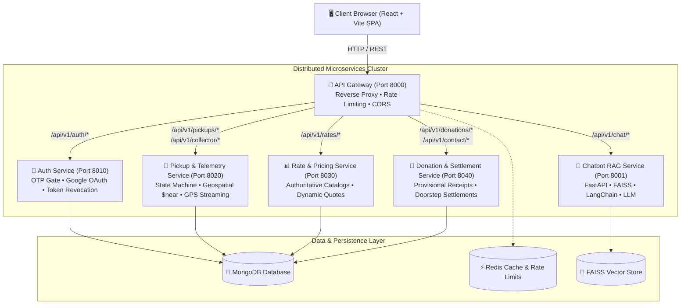

# ScrapSaathi — Distributed Microservices Platform ♻️

[](https://github.com/amankum2004/ScrapSathi)
[](https://vitejs.dev)
[](https://nodejs.org)
[](https://fastapi.tiangolo.com)
[](https://kubernetes.io)

An enterprise-grade, distributed marketplace platform connecting households, commercial waste generators, certified waste collectors, and recycling factories. Built with domain-driven microservices, an asynchronous event model, geospatial dispatching, real-time GPS telemetry, and a retrieval-augmented generation (RAG) sustainability assistant.

> 💡 **Looking for the hosted single-instance deployment?**  
> Check out the [`monolith`](https://github.com/amankum2004/ScrapSathi/tree/monolith) branch or the standalone `ScrapSathi-Monolith` folder optimized for 1-click free-tier hosting on Render / Railway.

---

## 🏛️ System Architecture



---

## 📦 Microservices Domain Matrix

| Microservice | Port | Technology | Key Responsibilities |
| :--- | :---: | :--- | :--- |
| **API Gateway** | `8000` | Node.js, Express, `http-proxy-middleware`, Helmet | Single ingress point, path-based reverse proxying, client CORS, centralized token inspection, global IP rate-limiting. |
| **Auth Service** | `8010` | Express, Mongoose, JWT, Nodemailer, Bcrypt | User lifecycle, multi-role RBAC, cryptographically verified OTP email gate, Google OAuth ID token validation, session revocation via `tokenVersion`. |
| **Pickup & Telemetry** | `8020` | Express, Mongoose Geospatial, Multer | Atomic conditional state machine (`ASSIGNED`, `IN_PROGRESS`, `SETTLED`), MongoDB `$near` collector dispatching, live GPS telemetry streaming. |
| **Rate & Pricing Catalog** | `8030` | Express, Mongoose | Authoritative rate cards, dynamic quote calculations, item categories, audit logs. |
| **Donation & Settlement** | `8040` | Express, Mongoose, Zod | Transparent eco-donations, provisional legal acknowledgements (`ACK-ECO-...`), doorstep weighment & digital payment settlement records. |
| **Chatbot RAG Assistant** | `8001` | FastAPI, Python 3.11, LangChain, FAISS | Natural language recycling queries, chunked vector retrieval, 30s streaming timeout resilience. |

---

## 🚀 Key Engineering & Architecture Highlights

### 1. High-Frequency Telemetry vs Read-Heavy Catalog Isolation
- **The Problem:** Live waste-collector vehicle GPS pings occur every 5 seconds per active driver. In a monolithic database, high-frequency location writes lock collections and degrade throughput for read-heavy operations like customer scrap price queries.
- **The Solution:** Decoupled `pickup-service` from `rate-service`. Telemetry writes scale independently without impacting user catalog browsing.

### 2. Atomic State Machine & Anti-Race Condition Dispatch
- Prevents double-assignment when two collectors attempt to accept the same pickup request concurrently.
- Uses conditional atomic MongoDB operations:
  ```javascript
  const request = await PickupRequest.findOneAndUpdate(
    { _id: id, status: 'REQUESTED' },
    { $set: { status: 'ASSIGNED', wasteCollector: collectorId } },
    { new: true }
  );
  if (!request) throw new ConflictError('Request has already been accepted by another collector');
  ```

### 3. Enterprise Auth Security & Instant Multi-Device Revocation
- **OTP Registration Gate:** Requires a signed `verificationToken` from the OTP verification endpoint before account creation.
- **Session Revocation:** Implements an incrementing `tokenVersion` on user records; logging out revokes all existing JWTs across all active sessions instantly.
- **Payload Verification:** Real-time magic byte inspection (`FF D8 FF`, `89 50 4E 47`, `52 49 46 46`) prevents disguised executable uploads.

---

## 🛠️ Quick Start & Local Orchestration

### Prerequisites
- [Docker](https://www.docker.com) and Docker Compose installed.
- [Node.js](https://nodejs.org) (v18+ or v20+) and [npm](https://www.npmjs.com).

### 1. One-Click Stack Run (Docker Compose)
Launch the entire microservices cluster + API gateway + Redis with one command:
```bash
# Clone the repository
git clone https://github.com/amankum2004/ScrapSathi.git
cd ScrapSathi

# Launch all microservices
docker compose up --build
```
Once initialized:
- **Web App (Frontend)**: `http://localhost:5173`
- **API Gateway**: `http://localhost:8000`
- **Gateway Health Check**: `http://localhost:8000/health`
- **Interactive OpenAPI Spec**: `http://localhost:8000/docs`

---

### 2. Local Development (NPM Workspaces)
To run microservices in concurrent development mode:
```bash
# Install root workspace dependencies
npm install

# Start all microservices concurrently
npm run dev
```

---

## 🧪 Testing & Quality Assurance

Automated integration tests validate contract stability across auth gates, geospatial queries, and quote generation:
```bash
npm test
```

---

## 📜 Monolith Deployment Alternative
For interview demos or cost-effective hosting on free cloud platforms (Render, Railway, Fly.io):
```bash
# Checkout the monolith branch
git checkout monolith

# Refer to DEPLOYMENT.md for step-by-step instructions
```

---

## 👥 Contributors & Authors
- **Aman Kumar** — Full Stack & Cloud Architect ([GitHub](https://github.com/amankum2004))
- **Pranav Raj** — Full Stack Developer ([GitHub](https://github.com/Praj-0417))
